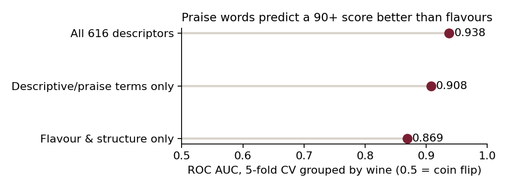
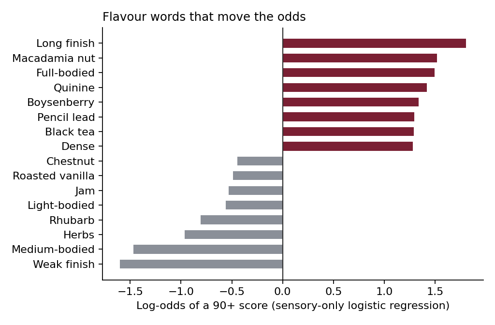

# What makes a 90-point Bordeaux? — and what to drink instead in Türkiye

**Live app:** [setosfk.github.io/projects/bordeaux-wine](https://setosfk.github.io/projects/bordeaux-wine/) · Python + R · [Türkçe özet ↓](#türkçe-özet)

Wine Spectator scored 14,349 Bordeaux wines (vintages 2000–2016). The reviews were turned into 985 binary
descriptors ("blackberry", "full-bodied", "gorgeous"…) by the Computational Wine Wheel. **Can the words
predict a 90+ score — and which words?** The app then turns the model into something useful: for every wine,
the cheeses to pair, Turkish wines made in the same style, and the shops nearest to you.

## Results (5-fold CV, grouped by wine so no label sits in train and test)

| Model | Accuracy | ROC AUC |
|---|---|---|
| Always "89 or below" (baseline) | 70.3 % | 0.500 |
| Bernoulli naive Bayes | 85.2 % | 0.921 |
| **Logistic regression (L2)** | **87.3 %** | **0.938** |
| Linear SVM | 87.2 % | 0.937 |
| Gradient boosting | 86.8 % | 0.934 |
| Random forest (random folds) | 86.1 % | 0.932 |
| *Literature: SVM, Dong et al. 2020* | *86.97 %* | — |
| *Literature: naive Bayes + category counts, Dong, Atkison & Chen 2021* | *87.32 %* | — |

**The simple model wins.** On sparse word data, logistic regression matches the published best and the tree ensembles don't beat it.

| Which words? (same logistic model) | ROC AUC |
|---|---|
| All 616 descriptors that appear at least once | 0.938 |
| Descriptive / praise terms only ("great", "range", "serious"…) | 0.908 |
| Flavour and structure only ("boysenberry", "full-bodied", "pencil lead"…) | 0.869 |



**The critic's verdict leaks into the text.** Praise words alone beat all flavour and structure words together.
The app's own "build a profile" predictor therefore uses the flavour-only model — letting you pick "gorgeous"
and then predicting a high score would be circular.



| Validation design | Logistic accuracy | What it tells |
|---|---|---|
| Random 5-fold | 87.2 % | the number papers report |
| Grouped by wine (all vintages of a label together) | 87.3 % | no "house-style" leakage: +0.02 pts |
| Temporal: train 2000–11, test 2012–16 | 85.2 % | −2.1 pts on future vintages (the realistic use) |

Also measured: predicting the exact score gives a mean absolute error of **1.38 points** (mean baseline 2.58);
price and score correlate at Spearman **0.64** (median release price $25 for 86–89 points, $144 for 94+, n = 9,739 wines with a price).
The R pipeline reproduces the Python numbers on the same folds (grouped logistic 87.32 % vs 87.25 %; naive Bayes identical).

## What changed from the 2024 version

The first version selected the top 45 descriptors by random-forest importance **on all rows, before splitting**,
then oversampled and tuned seven models. Re-running that pipeline shows:

- the selection leak inflated accuracy by only **0.4 pts** (83.8 % with the leak, 83.4 % with selection inside each fold);
- the real cost was throwing information away: the same random forest on all descriptors scores **86.1 %**;
- there was no baseline, no grouped or temporal check, and the README described "chemical attributes" the data does not contain.

## The app

- **Find a wine** by name or by **taste** (pick up to 8 flavours → chance of 90+, closest wines).
- **Cheese pairing** — six rules from the Bordeaux wine council (CIVB) and Wine Folly (e.g. Sauternes → Roquefort; full-bodied reds → aged hard cheeses), with Turkish cheeses first: Kars gravyeri, eski kaşar, Divle obruk tulumu, Ezine…
- **Turkish equivalents** — 23 Turkish wines with sourced grapes, body and oak (degustasyon.net tasting notes, kalpak.net), ranked by grape overlap (60 %), body (25 %) and oak (15 %). Fuller reds also get a native-grape idea: Öküzgözü–Boğazkere, which splits fruit and tannin the way Merlot–Cabernet does.
- **Where to buy** — wine and liquor shops nearest to you from OpenStreetMap (Overpass API), queried only when you ask, with a coordinate rounded to ~100 m. No online-shop links: in Türkiye alcohol may not be sold by mail, to under-18s, or at retail between 22:00 and 06:00 (Law 4250, art. 6).

## Data quality (found and fixed)

| Issue | Size | Fix |
|---|---|---|
| Double-encoded names (`Château`) | 13,463 / 14,349 names | 20-row repair table, identical in R and Python |
| Appellation buried in free-text names | 3,428 labels | parser; 0 unparsed; edge cases in `python/tests` |
| Descriptors never used | 369 / 985 | dropped (no label information used) |
| Wines with no descriptor | 11 | kept (they score as "unknown") |
| Same wine and vintage reviewed twice | 6 pairs, different scores | kept, always in the same CV fold |
| Missing price | 32.1 % | price analysis on the 9,739 priced wines only |

## Run it

```bash
# data: see data/README.md (Kaggle, 29 MB)
pip install -r python/requirements.txt
cd python && python run_analysis.py && python build_web.py && pytest -q tests && cd ..
streamlit run python/app.py                         # Python app

Rscript R/install.R && Rscript R/run_analysis.R     # R analysis on the same folds
Rscript -e 'shiny::runApp("R")'                     # R app

python -m http.server -d web                        # static app at localhost:8000
```

## Read with care

- One publication, one tasting panel: the model reads *Wine Spectator's writing*, not the wine.
- Equivalents are style rules, not a blind tasting; Turkish wine facts come from published tasting notes.
- Associations only — nothing here says an adjective *causes* a score.

## Layout

```
python/wine/        data.py (load, clean, parse) · models.py (designs, zoo) · pairing.py (cheese + equivalents)
python/             run_analysis.py · build_web.py · app.py (Streamlit) · tests/
R/                  wine_data.R · run_analysis.R · app.R (Shiny) · install.R
data/reference/     hand-built, sourced tables (see data/README.md)
results/            every number above · web/ static app · docs/ figures
```

Data: Dong, Z., Guo, X., Rajana, S. & Chen, B. (2020). *Understanding 21st Century Bordeaux Wines from Wine Reviews Using Naïve Bayes Classifier.* Beverages 6(1):5.
Kaggle licence "Unknown" — raw data is not redistributed. Code: MIT.

---

## Türkçe özet

**Soru:** Wine Spectator'ın 14.349 Bordeaux incelemesinden çıkarılmış 985 kelimeyle 90+ puan tahmin edilebilir mi, hangi kelimeler belirleyici?

- **Lojistik regresyon %87,3 doğruluk** (taban çizgisi %70,3; literatürdeki en iyi sonuç %87,32: naive Bayes + kategori sayımları, Dong, Atkison ve Chen 2021 — yani aynı düzey, üstü değil). Ağaç modelleri geçemedi.
- **Övgü kelimeleri tattan daha iyi tahmin ediyor** (AUC 0,908'e karşı 0,869): eleştirmenin hükmü metne sızıyor. Uygulamadaki tahmin bu yüzden yalnız tat ve yapı kelimelerini kullanıyor.
- Şarap bazında gruplu doğrulama sonucu değiştirmedi (şato sızıntısı yok); gelecek rekoltelerde (2012–16) doğruluk 2,1 puan düşüyor.
- 2024 sürümündeki sızıntı yalnız 0,4 puan şişirmiş; asıl kayıp 616 kelimeyi 45'e indirmekti.
- Her şarap için: **peynir eşleşmesi** (Kars gravyeri, eski kaşar, Divle obruk…), **Türkiye'deki muadilleri** (23 Türk şarabı, kaynaklı üzüm/gövde/meşe bilgisi) ve **en yakın satış noktaları** (OpenStreetMap). Türkiye'de alkollü içkinin posta ile satışı, 18 yaş altına satışı ve 22.00–06.00 arası perakende satışı yasak; bu yüzden çevrimiçi satış bağlantısı yok.
