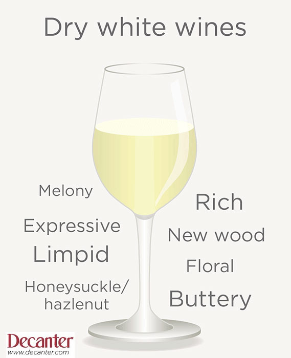
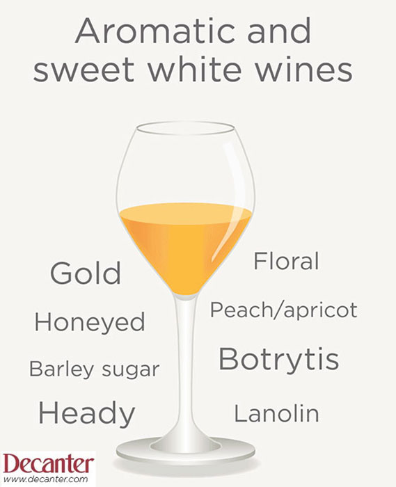
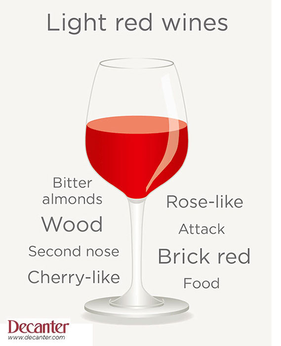
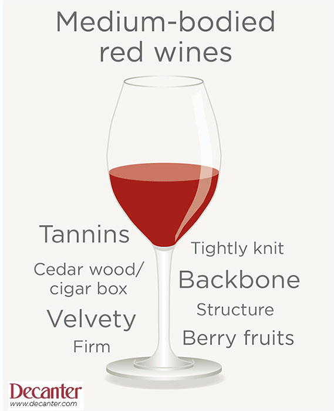

#### How to Read Wine Tasting Notes

##### Dry white wines

Example wine: Louis Latour, Meursault, 1998

Tasting Note: Clean, limpid medium yellow with a hint of green, quite
rich, a really lovely colour. Touch of new wood on the nose, ripe melony
fruit, slightly exotic, stylish and very expressive. Fine, floral,
honeysuckle fruit on the palate, with hazelnut overtones, rich and quite
buttery, yet good lemony acidity, very elegant but still young. Very
good balance, oak and fruit well blended in, an excellent example of
grape variety dominated by terroir, great persistence, very good future.

-   limpid – literally transparent, like clear water, while retaining
    its colour

-   rich – showing ripeness and viscosity, usually from the legs or
    ‘tears’ that form on the sides of the glass than from depth of
    colour

-   new wood – the vanilla-vanillin aroma of new oak, whether French or
    American

-   melony – signifies ripe, slightly exotic fruit, usually referring to
    Chardonnay. More exotic fruits could be pineapple, guava

-   expressive – expressive of either its grape variety, terroir or
    both. Stylish + expressive would be a finely turned out wine with
    character

-   floral – usual on the nose, but on the palate means the blend of
    florality and flavour

-   honeysuckle/hazelnut – typical expressions of a the Chardonnay grown
    in Meursault, rounded and attractive

-   buttery – the impression of ripeness with a certain fleshiness,
    often the result of barrel fermentation or barrel ageing

##### Aromatic and sweet white wines

Example wine: Château Lafaurie-Peyraguey, Sauternes, 1er Cru Classé 1985

Tasting note: Pure gold in colour, with hints of yellow still and no
amber. Floral, honeyed-peach and apricot, an impression of great
sweetness but not over-heady . Honey and lanolin flavours on the palate,
rich barley sugar sweetness, great fruit extract, good botrytis,
luscious, classy finish. A fully sweet Sauternes from a fine year,
tasting superbly at 15 years, with as long again in front of it.

-   gold – a golden colour indicates both original ripeness and
    sweetness as well as maturity. In 10 years time the golden colour
    will have taken on an amber glow, and the colour will progress from
    gold to amber as it matures further

-   floral – on the nose the smell of flowers or blossom as opposed to
    the smell of fruits

-   honeyed – many sweet wines do literally smell of honey, but hear it
    refers to ripe concentration and richness that is epitomised by the
    smell of honey

-   peach / apricot – the aroma of these stone fruits is also found in
    aromatice wines from the Viognier grape, and denotes warm, summery
    ripeness

-   heady – concentration of richness that literally goes to one’s head.
    An over-heady wine would be over-powering and unbalanced

-   lanolin – a smooth, creamy impression often associated with the
    Semillon grape at advanced ripeness, the opposite of tart

-   barley sugar – concentrated sweetness, but not sugary

-   botrytis – the effect of reducing the water in the grapes, thus
    increasing the sugars, when they are attacked by pourriture noble,
    or noble rot

##### Light red wines

Example wine: Allegrini, Valpolicella Classico Superiore 1998

Tasting note: Brick red colour, very fresh and young looking. Fine,
rose-like like bouquet, some sweetness in attack, drier on the second
nose. Clean, cherry-like fruit flavours on the palate, a hint of wood
and a touch of bitter almonds, good balance, long, dry finish. Fine long
flavour despite the liveliness, natural acidity present, a wine for
food.

-   brick red – denotes the absence of violet or purple colours of some
    very young wines, more a lack of intensity than a sense of maturity

-   rose-like – a delicate aroma, yet with a certain ripeness, always
    floral

-   attack – the strong first impression, one that jumps out of the
    glass

-   second nose – the more studied reflection gained by swirling the
    wine in the glass to release more than it does on the first
    impression

-   cherry-like – unless cited as ‘black cherries’ which carry a
    definite impression of ripeness, cherry-like indicates firm, vibrant
    fruit with a touch of acidity and none of the sweetness of, say,
    blackcurrants

-   wood – a sense of firmness and tannin, as opposed to ‘oaky’, which
    refers to the new casks in which the wine will have been aged

-   bitter almonds – often associated with cherries, a certain fruity
    bitterness, more refreshing than unpleasant

-   food – wines with exuberant, unrestrained fruit do not go well with
    food, for their fruitiness dominates. A ‘food wine’ is one that
    complements a meal

##### Medium-bodied red wines

Example wine: Château Léoville-Barton, St-Julien, 2ème Cru Classé 1990

Tasting note: Deep colour, velvety red, no real sign of ageing, still
very youthful and firm berry fruits on the nose, heavily Cabernet in
style, blackcurrant leaf, with a cedar wood / cigar box spice coming
through, concentrated fragrance followed by rich fruit. Same
concentrated, tightly knit fruit on the palate, wonderful ripeness,
still showing youthful black currants and blackberries, firm backbone
but ripe tannins, superb structure. Overall, a classic Medoc from a top
chateau in a great vintage. Ripe enough to enjoy now, but still a long
way off its best, which should be during its third decade.

-   velvety – a deep, rich smooth looking colour that always denotes
    very good ripeness at vintage time

-   firm – Reserved and with potential to develop, a positive
    description, not to be confused with “hard”, which is generally
    negative

-   berry fruits – small red fruits, covering the berry, cherry and the
    currant families. Individual red varietals tend when young to be
    dominated by one or two of these red fruits

-   cedar wood / cigar box – cedar wood is a characteristic of
    semi-mature and mature Cabernet-dominant wines especially from the
    Medoc, owing more to the style of wine than to oak ageing. Cigar box
    is similar – found in many Cabernet & Merlot wines tightly

-   knit – flavours that are firmly woven together, not loose or
    diffuse, shows good potential for development

-   backbone – an essential element for a well-structured wine

-   tannins – substance existing in the skin and pips of a grape that is
    necessary for the long development of a red wine. Tannin can also be
    obtained from the oak barrels in which such wines are matured

-   structure – a sense of solidity that has more to do with each
    element holding together than with weight
